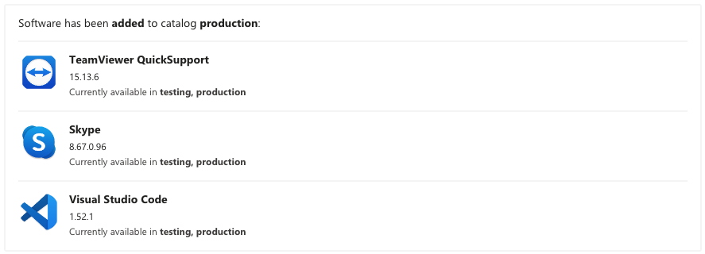

## Catalog-Reporter
### What does it do?
Catalog reporter generates reports based on changes to the catalogs in a munki repository.
It is currenlty is able to report to MSTeams via webhook. It displays: Title, Version, Catalogs and opt. Icon
### Requirements
Python3 with module plistlib (Munki's bundled python contains all requirements)
### Usage
The tool has a --help option
### Teams notification preview

### Future
I might look into Slack compatiblity and output as JSON option. 